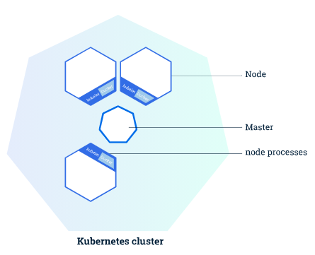
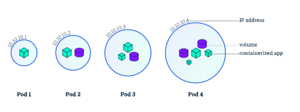
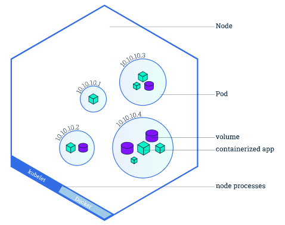

# Docker Containers

## How Docker works

## Useful commands

Run a docker container

`docker run`

# Kubernetes

Kubernetes automates the distribution and scheduling of application containers across a cluster in a more efficient way.

### Cluster Diagram

**Master** - responsible for managing and coordinating the cluster

**Node** - VM or physical computer that serves as a worker machine in a Kubernetes cluster that run applications

Nodes communicate with master using the Kubernetes API

---

## Kubernetes Deployment

Create a Kubernetes **Deployment** configuration.

- Instructs how to create and update instances of application
- _Kubernetes Deployment Controller_ continuously monitors application instances (if node down, it will start up another instance in another node)

**Create a Deployment**  
`kubectl create deployment <name> --image=<image>`  
What it does:

- Search for a suitable node to run the app instance
- Schedule the application to run on the node
- Configure cluster to reschedule instance on a new Node when needed

**List Deployments**  
`kubectl get deployments`

**View running application**  
Pods running inside Kubernetes are in a private, isolated network. They are visible from other pods and services within the same Kubernetes cluster, not outside, by default.

Create a proxy to forward requests into the private network:  
`kubectl proxy`

### Scaling out a Deployment

Why scale?

- Ensure new Pods are created and scheduled to Nodes with available resources
- Ensure traffic sent only to available Pods using Service
- Able to do Rolling updates without downtime

Command: `kubectl scale <deployment-type>/<name> --replicas=<number>` e.g. `kubectl scale deployments/kubernetes-bootcamp --replicas=4`

Checking the scaling:

- `kubectl get deployments`
  - _READY column_ - ratio of CURRENT/DESIRED replicas
  - _UP-TO-DATE_ column - number of replicas updated to achieve desired state
  - _AVAILABLE_ column - number of replicas of application available to users
- `kubectl get rs` to see the ReplicaSet created
  - _DESIRED_ - desired number of replicas
  - _CURRENT_ - currently running replicas

---

## Pods and Nodes

### Pod

> Atomic unit on Kubernetes.

- a group of one or more application containers (such as Docker) and some shared resources for those containers (e.g. shared storage, networking, specific ports to use)
- Containers in a Pod share an IP address and port space, always co-located and co-scheduled, and run in a shared context on the same Node
- Deployment creates Pods with containers inside them (not create the containers directly)
- Each Pod is tied to the Node where it is scheduled

### Node

- Worker machine in Kuberentes (virtual or physical)
- Each Node is managed by the Master
- A Node can have multiple pods
- Each Node runs at least
  - Kubelete - process responsible for communication between Master and Node; manages the Pods and containers
  - A container runtime (e.g. Docker) - responsible for pulling container image, unpacking the container and running the application

**Troubleshooting with kubectl**

---

## Service

An abstraction layer which

- Defines a set of Pods
- Expose Pods to external traffic
- Enables load balancing for Pods
- Enables service discovery for Pods

Pods targeted by a Service is determined by a _LabelSelector_

Different ways a Service can be exposed by specifying a `type` in the ServiceSpec:

- ClusterIP (default)
  - Exposes Service on an internal IP in the cluster
  - Makes Service only reachable from within the cluster
- NodePort
  - Exposes Service on the same port of each selected Node in the cluster using NAT
  - Makes a Service accessible from outside the cluster using `<NodeIP>:<NodePort>`
  - Superset of ClusterIP
- LoadBalancer
  - Creates an external load balancer
  - Assigns a fixed, external IP to the Service
  - Superset of NodePort
- ExternalName
  - Exposes the Service using an anbitrary name by returning a CNAME record with the name (by specifying `externalName` in the spec)

A Service routes traffic across a set of Pods. Discovery and routing among dependent Pods is handled by Kubernetes Services. Services match a set of Pods using **labels and selectors** (a grouping primitive that allows logical operation on objects in K8s)

Labels - key/value pairs attached to objects

**Expose a Service**  
`kubectl expose <service_name> --type="NodePort" --port <port>`

- Service will receive a unique cluster-IP, an internal port, an external-IP (IP of the Node)

To find out what port was opened externally: `kubectl describe services/<service-name>`

**Using labels**  
To see labels attached to objects: `kubectl describe <object>` e.g. `kubectl describe deployment`  
Query with label

- `kubectl get pods -l <label>`
- `kubectl get services -l <label>`  
  Apply new label
- `kubectl label pod $POD_NAME app=v1`

**Delete a Service**

1. `kubectl delete service -l <label>`
2. Confirm service is gone `kubectl get services`; `curl <service-ip>:<service-node-port>`; `kubectl exec -ti $POD_NAME curl localhost:8080`

## Useful `kubectl` commands

View cluster details:  
`kubectl cluster-info`

`kubectl get` - list resources (verify application deployed is running)

- `kubectl get pods`
- `kubectl get services`
- `kubectl get nodes`

`kubectl describe` - show information about a resource

- `kubectl describe pods` - details about Pod's container (e.g. UP address, ports used)

`kubectl logs` - print logs from a container in a pod  
`kubectl exec` - execute a command on a container in a pod
