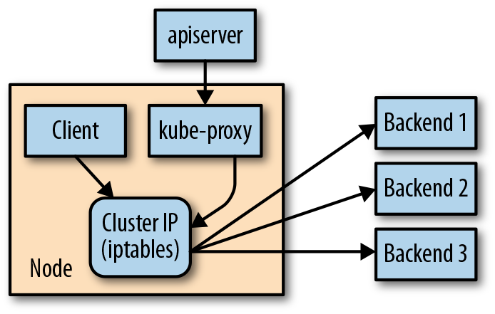
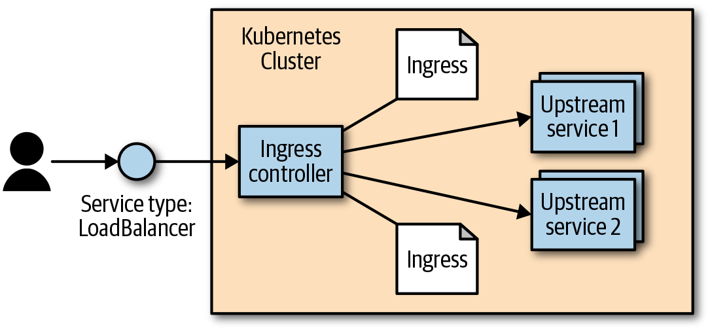

What's the difference between a mutable and an immutable system.

- artifact that we create and the record of how we created it
- old image can be used for rollback if an error occurs

Declarative configuration

- idea of storing declarative configuration in source control is referred as infrastructure as code
- imperative instructions rarely include the reverse instructions for rollback

Decoupling

- each component separated from other components by defined API and service load balancers
  - APIs provide a buffer between implementer and consumer
  - Load balancers provide a buffer between running instances of each service

Easy to build decoupled microservices
- pods (groups of container) can group together container images developed by different teams into a single deployable unit
- k8s services - load balancing, naming and discovery to isolate one microservice from another
- namespaces - isolation, access control
- ingress - combine multiple microservices into a single externalized API surface area

Separates development from specific machine (containerization)
High degree of portability (abstract from cloud service, infrastructure)
Ensure high level of utilization of machine - CPU time

Creating & Running Containers

How to build application container images?
- Application programs comprised of languag runtime, libraries, source code, external libraries (shared components in OS)
- Use Docker (container runtime engine) to package an executable and push it to a remote registry
  - Solve problems of dependency management - immutable images and infrastructure
- Container image
  - binary package that encapsulates all of the files necessary to run a program inside of an OS container

Container layering
- container images constructed with a series of filesystem layers, where each layer inherits and modifies the layers that came before it

Container configuration file
- provides instructions on how to set up the container environment and execute an application entry point

Containers - system vs application
- system container mimic VM and runs a full boot process, includes a set of system services such as `ssh`, `syslog`
- application container just run a single program


Dockerfile
- order layers from least likely to change to most likely to change in order to optimize image size for pushing and pulling

Multi-stage builds
- build image - contains compiler, toolchains, source code
- deployment image - contains compiled binary

Remote registry
- public or private registry
  - private requires authentication
  - public allows anyone to download images
- each cloud has their own container registry

Docker container runtime
- set up application container using container-specific APIs native to the target OS

Limit resource usage
- Limit memory
  - `--memory`, `--memory-swap` flags
- Limit CPU
  - `--cpu-shares`

Cleanup
- `docker rmi <tag-name>`, `docker rmi <image-id>`


## Deploy Kubernetes Cluster

local development - minikube (only creates a single-node cluster)
cloud-based development - managed service by AWS, Azure, Google

### Cluster components
- deployed using Kubernetes itself
- they run in the kube-system namespace

Kubernetes Proxy
- routes network traffic to load-balanced services in the cluster
- present on every node (in a container)
- setup by DaemonSet

Kubernetes DNS
- naming and discovery for services defined in cluster
- also runs as a replicated service (multiple servers in cluster)
- runs as a Kubernetes deployment

Kubernetes UI
- GUI interface to explore cluster, create new containers

## Common kubectl commands

Namespaces
- organise objects in cluster (each namespace is like a folder)
- default namespace is `default`, pass `--namespace` flag to change; pass `--all-namespaces` flag to see all objects

Contexts
- change default namespace permanently
- recorded in kubectl configuration file (`$HOME/.kube/config`)
- create a context with different default namespace
  - `kubectl config set-context my-context --namespace=mystuff`
  - run `kubectl config use-context my-context` to use the newly created context
- Can be used to manage diff clusters or diff users for authenticating to those clusters using `--users` or `--clusters` with `set-context`

View Kubernetes API Objects
- RESTful
  - each object exists at a unique HTTP path (e.g. https://your-k8s.com/api/v1/namespaces/default/pods/my-pod)
  - kubectl command makes HTTP requests to these URLs to access the K8s objects
- `kubectl get <resource-name>`
  - list all resources in the current namespace
- `kubectl get <resource-name> <obj-name>`
  - get specific resource
- view more details
  - `-o` flag, to view as JSON/YAML - use `-o json` or `-o yaml`
- remove headers - `--no-headers`
- extract specific fields from object, uses the JSONPath query language
  - e.g. `kubectl get pods my-pod -o jsonpath --template={.status.podIP}`
- more details information
  - `kubectl describve <resource-name> <obj-name>`

Create, Update, Destroy Kubernetes Objects
- For objects stored in yaml files
  - create: `kubectl apply -f obj.yaml`
  - update: `kubectl apply -f obj.yaml` (if make changes to object)
- To see what `apply` command will do without making actual changes
  - `--dry-run` flag
- `apply` command records history of previous configurations in an annotation within object
  - manipulate records with `edit-last-applied`, `set-last-applied`, `view-last-applied` (e.g. `kubectl apply -f myobj.yaml view-last-applied`)
- delete object
  - `kubectl delete -f obj.yaml`
  - delete using resource type and name: `kubectl delete <resource-name> <obj-name>`


Labelling and Annotating objects
- add label/annotation
  - `kubectl label <resource-name> <label-name> <label>` (e.g. `kubectl label pods bar color=red`)
- `label` and `annotate` will not overwrite existing label by default
  - use `--overwrite` flag
- remove label
  - use `<label-name>-` syntax (e.g. `kubectl label pods bar color-`)

Debugging
- `kubectl logs <pod-name>`
  - add `-f` flag to continuously stream the logs
- choose container to view in Pod: `-c` flag
- execute a command in running container
  - `kubectl exec -it <pod-name> -- bash`
- attach to running process, allow to send input assuming process is set up to read from stdin
  - `kubectl attach -it <pod-name>`
- copy files to and from a container
  - `kubectl cp <pod-name>:</path/to/remote/file> </path/to/local/file>`
- access Pod via network
  - `kubectl port-forward <pod-name> 8080:80` (opens a connection that forwards traffic from local machine port 8080 to remote container on port 80)
- see how cluster is using resources
  - `kubectl top <oject>` (can be `nodes` or `pods`)


## Pods
- A collection of application containers and volumes running in the same execution environment
- Smallest deployable artifact in cluster
- Containers within a Pod share a number of Linux namespaces
  - Same IP address and port space
  - Same hostname, can communicate using native interprocess communication channels

What to put in a Pod? Thinking guidelines:
- Scaling strategy for each application/service
- Will these containers work correctly if placed on different machines?

### Pod Manifest

Scheduler
- Uses K8s API to find Pods that haven't been scheduled to a node
- Places Pods onto nodes depending on resources and constraints expressed in Pod manifests
- Ensure Pods from the same application are distributed onto different machines for reliability sake

**Creating a Pod**

`kubectl run kuard --generator=run-pod/v1 \
--image=gcr.io/kuar-demo/kuard-amd64:blue`

**Deleting a Pod**

`kubectl delete pods/<name>`

- Not immediately killed, have a termination grace period of default 30s for Pod to finish any remaining active requests
- Data stored in containers associated with Pod will be deleted as well
  - To persist data: use `PersistentVolumes`

**Creating a Pod Manifest**
`
  apiVersion: v1
  kind: Pod
  metadata:
    name: kuard
  spec:
    containers:
      - image: gcr.io/kuar-demo/kuard-amd64:blue
        name: kuard
        ports:
          - containerPort: 8080
            name: http
            protocol: TCP
`

**Running Pods**

`kubectl apply -f <manifest-yaml-file>`

**Accessing Pod**

- Using Port Forwardning
  - `kubectl port-forward kuard 8080:8080`
  - Can access pod at http://localhost:8080
- Get more info with logs
  - `kubectl logs kuard` (`-f` flag to stream logs continuously)
  - > Good to use a log aggregation service like `fluentd`, `prometheus` - search and filter, store longer duration of logs, aggregate logs from multiple Pods into a single view
- Run commands in container with exec
  - Get interactive session with `-it` flags
- Copy files to and from containers
  - `kubectl cp <pod-name>:<remote-file-path> <local-file-path>`

### Health Checks

**Liveness Probe**
Health checks for application *livelinesss*
- Run application-specific logic (e.g. loading a web page) to verify that application is not just still running, but is functioning properly
- Liveness health checks to be defined in Pod manifest (since it's application specific)
- Default response to a failed liveness check is to restart the pod (actual behavior is controlled by Pod's `restartPolicy` - `Always`, `OnFailure`, `Never`)

**Readiness Probe**
- Readiness describes when a container is ready to serve requests
- Containers that fail this check are removed from service load balancers
- Configured similarly to liveness probes

**Types of Health Checks**
- HTTP, tcpSocket, exec probes (if script returns a zero exit code, probe succeeds; otherwise, fails)

### Resource Management

**Resource Requests: Minimum Required Resources**
- commonly requested resources: CPU and memory
- Resources are requested per container (diff container diff requirements)
- Scheduler ensure sum of all requests of all Pods on a node does not exceed the capacity of the node

**Capping Resource Usage with Limits**
- Set maximum on a Pod's resource usage via resource limits
- Kernel configured to ensure consumption cannot exceed the established limits

### Persisting Data with Volumes

- Under `spec.volumes` section in manifest
- `volumeMounts` array in container definition
  - Defines volumes that are mounted into a particular container and path where each volume should be mounted
  - Two different containers in a Pod can mount the same volume at different mount paths

**Ways of using Volumes with Pods**
- Communication/synchronization
- Cache
- Persistent data
- Mounting the host filesystem
  - `hostPath` volume, can mount arbitrary locations on the worker node into the container

**Persist data using Remote Disks**
- Methods for mounting volumes over network
  - NFS, iSCSI, cloud provider-based storage APIs

### Summary
- Pods are atomic unit of work in a k8s cluster
- Pods comprised of one of more containers working together
- Create a pod -> write a manifest -> submit it to K8s API server using CLI tool / HTTP calls
- K8s scheduler finds a machine where Pod can fit -> kubelet daemon on the machine is responsible for creating the containers correspond to the Pod + perform health checks
- One a Pod is scheduled to a node, no rescheduling occurs if that node fails (this will be handled by ReplicaSet)


## Labels and Annotations

### Labels
- key/value pairs that can be attached to Kubernetes objects
- used to identify, group, view and operate objects
- Many things are managed via label selectors. E.g.
  - ReplicaSets - find Pods that they are managing
  - Service load balancer - find Pods to bring traffic to
  - Pod creation - find node that it can be scheduled onto

**Motivation for labels**
- Used to deal with a set of objects instead of single istances
- Flexible to adapt to different groupings and hierarchies

**Label Syntax**
- keys
  - optional prefix and a name, separated by a slash
  - prefix if specified, must be a DNS subdomain with a 253 char limit
  - key name is required and must be < 63 char
  - e.g. `acme.com/app-version`
- values
  - strings with a max length of 63 char

**Common actions with Labels**
- apply labels
- modify labels
- remove labels

**Label Selectors**
- used to filter Kubernetes objects based on a set of labels
- How to use selectors
  - Select specific label
    - e.g. list Pods that had the ver label set to 2 `kubectl get pods --selector="ver=2"`
  - Two selectors separated by a coma (logical AND)
    - e.g. `kubectl get pods --selector="app=bandicoot,ver=2"`
  - If label is one of a set of values
    - e.g. `kubectl get pods --selector="app in (alpaca,bandicoot)"`
  - If label is set
    - e.g. `kubectl get deployments --selector="canary"`

Operator | Description 
--- | ---
key=value | key is set to value
key!=value | key is not set to value
key in (value1, value2) | key is one of value1 or value2
key notin (value1, value2) | key is not one of value1 or value2
key | key is set
!key | key is not set

**Label Selectors in API objects**

### Annotations
- place to store additional metadata for Kubernetes objects with the sole purpose of assisting tools and libraries
  - extra information: where an object came from, how to use it, policy around that object
- Primary use case is for rolling deployments
  - track rollout status; provide info required to roll back a deployment to previous state

**Defining Annotations**
- Annotation keys same format as label keys (namespace part of key is more important since used to communication information between tools)
- Value: free-form string field
- Defined in `metadata` section in every Kubernetes object:
```yaml
...
metadata:
  annotations:
    example.com/icon-url: "https://example.com/icon.png"
...
```

## Service Discovery

Problem of finding which processes are listening at which addresses for which services

DNS is the traditional system of service discovery on the internet (relatively stable name resolution with wide and efficient caching)
- Downsides
  - stale cache mappings of IP
  - delay between when a name resolution changes and when client notices
  - no purpose-built load balancing for multiple IPs in a DNS record (usually just randomize or round-robin)

### Service Object

Service object is a way to create a named label selector

Use `kubectl expose` command to create a service
- Service is assigned a new type of virtual IP called a cluster IP (special IP address the system will load-balance across all of the Pods that are identified by the selector)
- to interact with services -> do port-forwarding

**Service DNS**
- Kubernetes DNS service (exposed to pods in cluster) is installed as a system component when the cluster is first created
  - Provides DNS names for cluster IPs

**Readiness Checks**
- Service object helps to track which Pods are ready via a readiness check

**Allow new traffic to Pods**
NodePorts
- system picks a port where every node in cluster will then forward traffic to that port to the service
- After service is assigned a port, we can use the port to hit any of the cluster nodes
  - Each request sent to the service will be randomly directed to oen of the Pods that implements the service
- Accessing the service
  - Same network: access it directly
  - Different network: SSH tunelling
    - `ssh <node> -L 8080:localhost:32711`

**Cloud Integration**
LoadBalancer type
- builds on NodePort type by additionally configuring the cloud to create a new load balancer and direct it at nodes in the cluster
- assigned a public address

### Advanced

**Endpoints**
- Some applications want to be able to use services without using a cluster IP -> use Endpoints object
- For every Service object, Kubernetes creates a buddy Endpoints object that contains the IP addresses for that service
  - advanced application use K8s API to lookup endpoints and call them; K8 API can "watch" objects and be notified as soon as they change (e.g. `kubectl get endpoints <service-name> --watch`)

**Manual Service Discovery**
- K8s services are built on top of label selectors over Pods
  - Use labels to identify Pods, get IP address from Pods
  - > However, keeping the correct set of label selectors to use in sync can be tricky, hence Service object was created

**kube-proxy and Cluster IPs**


kube-proxy
- watches for new service in the cluster via the API server
- if set of endpoints for a service changes, the set of iptables rules is rewritten (helps to manage the iptables?)

cluster IP
- usually assigned by the API server as the service is created
- can be specified by user, once set, the cluster IP cannot be modified without deleting and recreating the Service object

**Cluster IP environment variables**
- store host and port in environment variables of pods

### Connecting with Other Environments
1. Create an "internal" load balancer in VPN -> deliver traffic from a fixed IP address into the cluster -> use traditional DNS to make the IP address available to external resource
2. Run kube-proxy on external resource and program that machine to use the DNS server in the K8s cluster

## HTTP Load Balancing with Ingress

Useful links:
https://medium.com/google-cloud/kubernetes-nodeport-vs-loadbalancer-vs-ingress-when-should-i-use-what-922f010849e0#:~:text=Unlike%20all%20the%20above%20examples,controllers%20that%20have%20different%20capabilities.
https://medium.com/swlh/kubernetes-ingress-controller-overview-81abbaca19ec#:~:text=Strictly%20speaking%2C%20an%20Ingress%20is,responsible%20for%20fulfilling%20those%20requests.

What's limited about using Service objects?
- Only operates at Layer 4 (forwards TCP and UDP connections, doesn't look inside of connections)
- For type:NodePort, have to have clients connect to a unique port per service
- For type:LoadBalancer, need to allocate expensive/scarce cloud resources for each service

How this is solved in non-Kubernetes situations?
- "virtual hosting" - host many HTTP sites on a single IP address
- Uses a load balancer or reverse proxy to accept incoming connections (on HTTP(80) and HTTPS(443))
  - Parses HTTP connection, based on Host header and URL path, proxies the HTTP call to some other program

Kubernetes HTTP-based load-balancing system - Ingress
- standardize load-balancing configuration
- move configuration to a standard K8s object
- merge multiple Ingress objects into a single config for load balancer



- Ingress controller
  - Software system exposed outside the cluster using a service of type: LoadBalancer
  - Proxies requests to "upstream" servers
  - Up to users to install and manage an outside controller (pluggable)
  - Example Ingress controller - Contour (others include Nginx, Istio)
    - Install with `kubectl apply -f https://j.hept.io/contour-deployment-rbac` (requires cluster-admin permissions)
    - Creates a namespace called `heptio-contour` -> Inside namespace creates a deployment (with two replicas) and an external-facing service of type: LoadBalancer -> sets up correct permissions via a service account and installs a CustomResourceDefinition for some extended capabilities
    - Fetch external address via `kubectl get -n heptio-contour service contour -o wide`

Ingress Object vs Ingress Controller
- Ingress Object is an API object that defines the traffic routing rules (e.g. load balancing, SSL termination, path-based routing, protocol)
- Ingress Controller is the component responsible for fulfilling those requests

**Configuring DNS**
- Configure DNS entries to the external address for load balancer
  - A and CNAME records
**Configuring a Local hosts File**

### Advanced Ingress Topics

Running Multiple Ingress Controllers
- specify which Ingress object is meant for which Ingress controller using the `kubernetes.io/ingress.class` annotation

Multiple Ingress Objects
- Ingress controllers should read them all and try to merge them into a coherent configuration

Ingress and Namespaces
- Ingress object can only refer to an upstream service in the same namespace (cant use an Ingress object to point a subpath to a service in another namespace)
- Multiple Ingress objects in different namespaces can specify subpaths for the same host

Path Rewriting
- Used to modify the path in the HTTP request as it gets proxied
  - usually specified by an annotation e.g. for NGINX Ingress controller, use the annotation `nginx.ingress.kubernetes.io/rewrite-target: /`

Serving TLS
- Specify a secret with TLS certificate and keys either using YAML files (see `./kubernetes/tls-secret.yaml`) or using the kubectl command (`kubectl create secret tls <secret-name> --cert <certificate-pem-file> --key <private-key-pem-file>`)
- Once uploaded the cert, reference it in an Ingress object
  - Specifies a list of certs along with the hostnames that those certs should be used for (see `./kubernetes/tls-ingress.yaml`)
  - If multiple Ingress objects specify certs for the same hostname -> behavior is undefined

## ReplicaSets

Why multiple replicas of a container?
- Redundancy - tolerate failures
- Scale - handle more requests
- Sharding - handle diff parts of a computation in parallel

Cluster-wide Pod manager
- ensure right types and number of Pods and running at all times
- Provide self-healing for application at infra level
  - Pods managed are automatically rescheduled under certain failure conditions

### Reconciliation Loops
- Central concept is the notion of desired state versus observed or current state
- The reconciliation loop is constantly running, observing the current state and taking action to try the make the observed state match the desired state

### Relating Pods and ReplicaSets
- ReplicaSets create and manage Pods but do not own them
- Use label queries to identify the set of Pods they should be managing
- Decoupling of Pods and ReplicaSets enables several behaviors
  - Adopting existing containers